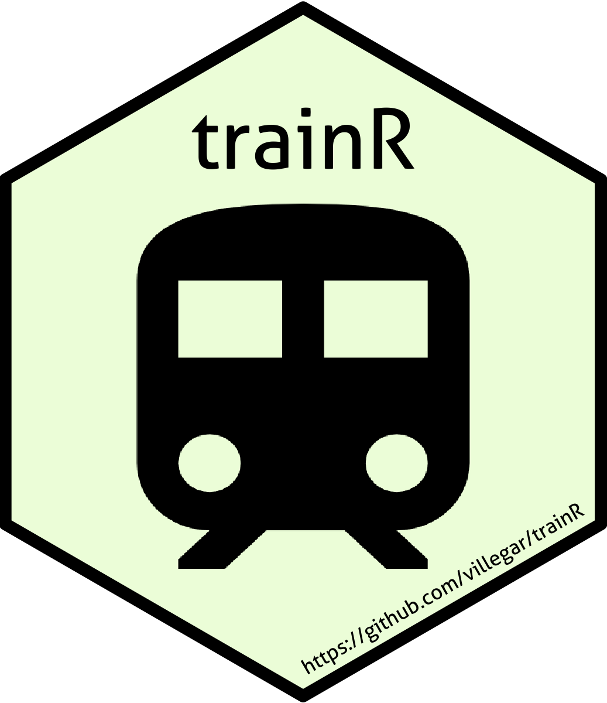

<!-- README.md is generated from README.Rmd. Please edit that file -->

# trainR: An Interface to the National Rail Enquiries Systems 

<!-- badges: start -->

<!-- badges: end -->

The goal of trainR is to …

## Installation

You can install the released version of trainR from
[CRAN](https://CRAN.R-project.org) with:

``` r
install.packages("trainR")
```

And the development version from [GitHub](https://github.com/) with:

``` r
# install.packages("devtools")
devtools::install_github("villegar/trainR")
```

## Example
