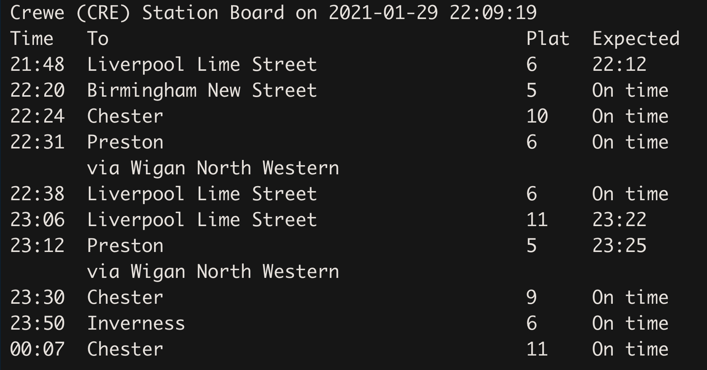
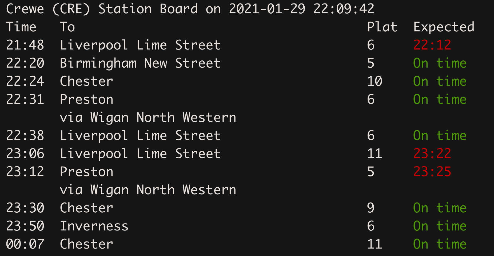

<!-- README.md is generated from README.Rmd. Please edit that file -->

# trainR: An Interface to the National Rail Enquiries Systems 

<!-- badges: start -->

[](https://cran.r-project.org/package=trainR)
[](https://github.com/villegar/trainR)
[](https://github.com/villegar/trainR/actions)
[](https://www.tidyverse.org/lifecycle/#experimental)
<!-- badges: end -->

The goal of `trainR` is to provide a simple interface to the National
Rail Enquiries (NRE) systems. There are few data feeds available, the
simplest of them is Darwin, which provides real-time arrival and
departure predictions, platform numbers, delay estimates, schedule
changes and cancellations. Other data feeds provide historical data,
Historic Service Performance (HSP), and much more. `trainR` simplifies
the data retrieval, so that the users can focus on their analyses. For
more details visit <https://www.nationalrail.co.uk/46391.aspx>.

## Installation

You can install the released version of trainR from
[CRAN](https://CRAN.R-project.org) with:

``` r
install.packages("trainR")
```

And the development version from [GitHub](https://github.com/) with:

``` r
# install.packages("devtools")
devtools::install_github("villegar/trainR", "dev")
```

## Setup

Before starting to retrieve data from the NRE data feeds, you must
obtain an access token. Visit the following website for details:
<http://realtime.nationalrail.co.uk/OpenLDBWSRegistration/>

Once you have received your access token, you have to store it in the
`.Renviron` file; this can be done by executing the following command:

``` r
trainR::set_token()
```

This will open a text file, `.Renviron`, add a new line at the end (as
follows):

``` bash
NRE="<token>"
```

`<token>` should be replaced by the access token obtained from the NRE.
Save the changes and restart your R session.

You only need to perform this configuration once.

## Example

Load `trainR` to your working environment:

``` r
library(trainR)
```

### Arrivals board at Reading Station (RDG)

Generated on 2021-02-04 23:19:50.

``` r
rdg_arr <- trainR::GetArrBoardWithDetailsRequest("RDG")
print(rdg_arr)
#> Reading (RDG) Station Board on 2021-02-04 23:19:50
#> Time   From                                    Plat  Expected
#> 23:10  Penzance                                10    23:15
#> 23:19  Newbury                                 7A    23:16
#> 23:27  London Paddington                       -     Cancelled
#> 23:32  London Paddington                       7     On time
#> 23:35  Oxford                                  3     On time
#> 23:43  London Paddington                       14    On time
#> 23:46  Didcot Parkway                          8     On time
#> 23:49  Basingstoke                             -     Cancelled
#> 23:50  Manchester Piccadilly                   7     On time
#> 23:58  London Paddington                       9B    On time
```

<!-- Inspect the `rdg_arr` object: -->

<!-- #### Previous calling points -->

### Departures board at Reading Station (RDG)

Generated on 2021-02-04 23:19:51.

``` r
rdg_dep <- trainR::GetDepBoardWithDetailsRequest("RDG")
print(rdg_dep)
#> Reading (RDG) Station Board on 2021-02-04 23:19:51
#> Time   To                                      Plat  Expected
#> 23:18  London Paddington                       10    On time
#> 23:20  Ealing Broadway                         7A    On time
#> 23:28  Worcestershire Parkway                  -     Cancelled
#> 23:34  Redhill                                 8A    On time
#> 23:36  Didcot Parkway                          7     On time
#> 00:08  Oxford                                  9B    On time
#> 00:18  London Paddington                       14    On time
#> 00:28  Didcot Parkway                          7     On time
#> 00:49  Penzance                                8     On time
#> 01:15  London Paddington                       13A   On time
```

### Add some colour (Terminal output only)

Now you can add some colour to the service boards, based on their
expected time:

  - “On time” and early services: `green`
  - “Delayed” and delayed by 5 or less minutes: `yellow`
  - “Cancelled” and delayed over 5 minutes: `red`

Without colours:

``` r
trainR::GetDepBoardWithDetailsRequest("CRE")
```



With colours:

``` r
options(show_colours = TRUE)
trainR::GetDepBoardWithDetailsRequest("CRE")
```



<!-- #### Previous calling points -->

## Acknowledgements

Access to the data feeds it is only possible thanks to the National Rail
Enquiries. This package is just a tool to facilitate access to the data.
For more information about the available data feeds, visit
<https://www.nationalrail.co.uk>.


